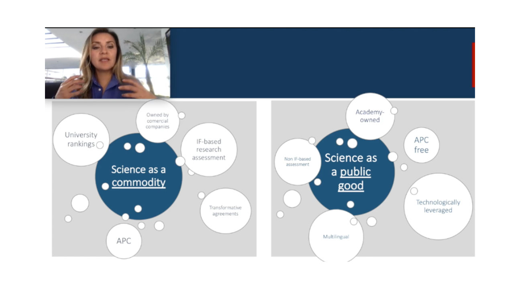
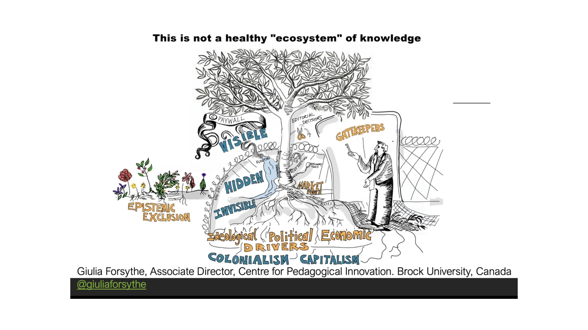

# Open Access Week
## Review of Open and Engaged Conference 2020: inequalities in scholarly communication hosted by the British library - Monday 19th October 2020

Open access week (19th-25th October 2020) had lots of interesting events but I chose to attend the Open and Engaged conference on inequalities in scholarly communication hosted by the British library.  It had three sessions: creating a more equitable publishing ecosystem, interventions beyond libraries and widening participation in open research. It was an online conference, which is becoming the new norm for academic events. All of the speakers were incredibly inspiring in terms of their open research and it was a bit of a shame that we were not able to ask them questions as it was such a packed schedule. However, there was a stream of appreciative messages flying on to twitter throughout the day. 

***I want to draw out three issues that were raised during the day that I think as open science practitioners we need to be aware of and try to address:***

## Open Access (OA) publishing needs to change

The APC fees that are required for gold open access are disadvantaging some researchers and this is not going to improve with the transformative deals that are currently being made between institutions and publishers. It was clear from two talks given that the global south are doing a better job at making science for the public good!

[Reggie Raju](https://www.researchgate.net/profile/Reggie_Raju2), from the University of Cape Town, talked about a social justice driven OA model where institutions publish their own research freely to bridge the information divide between the global north and global south. He pointed out -  “If there is no subscription budget then what is there to transform” - meaning that institutions in the global south have to do things differently.

[Arianna Becerril-Garcia](http://ariannabecerril.info/) presented the publishing situation in Latin America, which is a non-for-profit non-APC academy owned open access publishing system. That's a bit of a mouth full but basically means it is free to all! She explained how well established it is with many benefits such as open source software and research metrics. It was a surprise to me that this type of system existed. Coming from Britain, where we now pay as authors to publish openly and also pay to read non-open papers, I thought that commercial publishers were dominant worldwide. 

*This image is from Arianna Becerril-Garcia's presentation and shows her talking about science as a public good in Latin America (permisson given by speaker).*

It made me think that those of us relying on publishing in high impact journals from the big five publishers are doing something very wrong. As researchers we seem to be doing all the work and still having to pay for it - writing articles, peer reviews, paying for publishing and then paying to read non-open articles. We need to encourage researcher-led publishing initiatives so that we can move away from large publishers that seem to be getting all of the profit. It is us researchers that have the power to do this.

So what do we do about this? One suggestion is to use Peer Community in for your publications. They are a non-profit scientific organisation that creates a community of experts in a specific field ([PCI Archaeology](https://archaeo.peercommunityin.org/) for us!) that will review pre-prints for free. You just need to put your pre-print into an open repository (Open Science Framework, arXiv, etc) and then ask for a review. This review can then be used when you submit to a journal for publication but you don’t need to publish it really as it will already have gone through peer review so the research lifecycle is complete. This is a way to get around using traditional journals and I feel that it will become popular once we can move past the idea that it is important how many articles we have in high impact journals. 

## Addressing the uncomfortable truth 

After a year when Black lives matter has come to the forefront of all researchers' minds, there were several presentations about how we need to face up to the uncomfortable ideas and actions of the past. 

[Melissa Bennett](https://www.archivozmagazine.org/en/decolonising-the-archive-responsibilities-for-researchers-and-archive-professionals-part-i/) spoke very honestly and passionately about her work concerning decolonising archives. How we have to realise that our work is coming from an area of privilege (if we are based in the UK or US) and we have to reach out to those who the story is about. She also drew our attention to the way that unconscious bias can creep into archives and academic work. She showed us an example of her own work where she had been picked up for using inappropriate phasing and also showed labels from archives that had not described photos fully meaning certain individuals seemed less important. These were important reminders that we need to be careful to check our work and think about presenting it to the audience most affected by it.

Being a UCL Alumni myself, I was fascinated to hear about the project [Bricks and mortals](https://www.ucl.ac.uk/culture/projects/bricks-mortals) - a history of eugenics told through buildings, by Subhadra Das. She explained that many of the buildings are named after academics, such as Francis Galton, who in 1883 coined the term ‘eugenics’ - the study of human characteristics passed on through the generations with a view to improving the human species. She said that we need to acknowledge that this was not right - “Racism = Racism”. Many of the buildings names are now being changed but her project aims to highlight this history to bring it out into the open.

*The image shows Subhadra Das talking about addressing the uncomfortable history of UCL academics by acknowledging it exists (permission given by the speaker).*

Personal connections to research often make the best projects and this was definitely demonstrated by Majd Al-Shihabi, who told us about [Palestine open maps](https://palopenmaps.org/). He explained how he is digitizing a large collection of maps from the 1940s to preserve the history of Palestine since many villages have been erased through Israeli settlement. He showed us the village of his grandparents that has now completely disappeared and talked about how his grandmother is helping him to translate the names of villages back into arabic. The project will also capture other geographic and historical information such as village statistics, historical photos and oral histories to become an invaluable resource to show the transformation in the human geography of historic Palestine over the past 70+ years.

All three talks encompassed why it is so important to open up research. Being able to record history in an open way so that the people affected by it can be involved and learn more about it. Also to make other audiences aware of history that we might not be so proud of, so that we can reflect on it, is a very powerful use of open research.

## Who is science for? 

This is something that I have been thinking a lot about this year and I’m really trying to promote the idea that all research should be open access. Not just publications but the whole thing! I have benefitted a lot from the move to online research activities and my hope is that this will now be the new norm going forward. It increases inclusion, and also usually diversity, if it is done well and this can only be a good thing.

*Image from Leslie Chan's talk showing the deep rooted unhealthy ecosystem of knowledge (permisson given by speaker).*

[Leslie Chan](https://www.utsc.utoronto.ca/~chan/index.html) spoke of a need to address the deeply embedded systemic and racial inequalities in science. He talked about this being the year of reckoning due to the Covid-19 pandemic and the idea of a social vaccine ([Baum & Friel 2020](https://insightplus.mja.com.au/2020/36/covid-19-the-need-for-a-social-vaccine/)) to bring about a life of security, fair opportunities, a habitable planet that supports biodiversity and just governance. 

With everyone having such a strange year due to the pandemic, it does feel like this is a moment that something could change and my hope is that open access and more generally open science will become mainstream. If there was ever a moment to do this, it is now!
