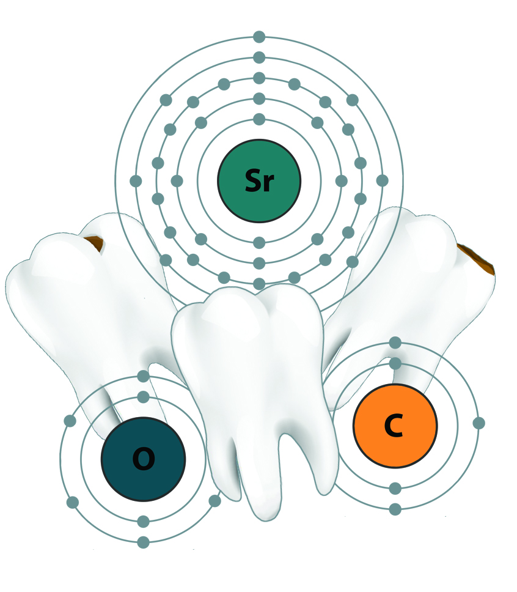
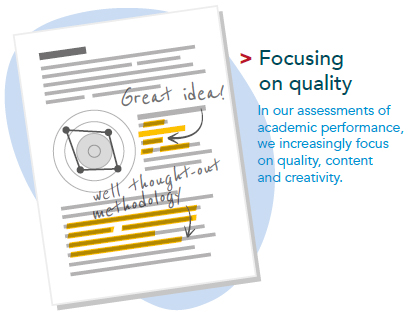

# The Open Archaeobotanist Guest Blog - Dr Esther Plomp

**[Dr. Esther Plomp](https://orcid.org/0000-0003-3625-1357)** is currently a Data Steward at the Delft University of Technology, Faculty of Applied Sciences, where she supports researchers in making their outputs more openly available and contributes to a more equitable way of knowledge generation. 

# Why I am an Open Archaeologist

## Why did you become an Open Archaeologist?
I think access to information and knowledge is a human right that is in the current ways of practising research not always honoured. In order to have the largest impact with your research it should be accessible and available to others whenever possible, rather than hidden behind closed doors in institutions that are inaccessible for most of the world’s population. Especially archaeologists, studying past human activity, should consider the value of open knowledge as we often work in cooperation with communities and the public. We should allow for more participation in scholarship and respect data sovereignty whenever this applies in the local context. I believe that there is [“no open science if science is not open to all”](https://thepsychologist.bps.org.uk/volume-33/november-2020/bropenscience-broken-science). 

## How did you become an Open Archaeologist?
I wasn’t very familiar with the concept of Open Science until I tried to write up the second publication from my PhD research ([Unlocking Teeth](https://zenodo.org/record/3929551#.YHcTOOj0mUk)). The first publication of this project was a method paper, which allowed me to describe everything in quite some detail. Even with this detailed description it was probably still challenging to reproduce the findings without contacting me, but it at least felt like a good attempt at describing the method that I co-developed. 

The second publication of my PhD project was based on this method, but followed two years later. Over these years the original protocol was tweaked to increase efficiency. Now, however, the word count limit of the journal didn’t allow a full description of a method and instead there was only space to refer to the original paper. This was something that really started to bother me: Why was one of the most crucial parts of the paper, how the data was generated, not important enough to be fully describe in the paper itself? 

Image by Esther Plomp

I remember watching one of the webinars of [Protocols.io](https://www.protocols.io/) that explained that this platform would allow just that! On Protocols.io I could [share my method](https://www.protocols.io/view/chromatographic-separation-of-neodymium-isotopes-i-xzmfp46) by describing it fully and I could also share it with everyone! At that time there were no protocols available yet on the platform for archaeologists, so publishing my first protocol was a bit scary. To this day I am still happy I had the courage to do so. I’m proud that it is now possible to trace the steps I took and in doing so I also saved myself time! I had several requests from my own lab members and other colleagues about my protocols. Instead of trying to organise my lab notes in a comprehensible manner in a relatively short period, I could just directly refer them to the protocols on Protocols.io! 

## What is your biggest frustration at the moment in terms of the adoption of open science practices in archaeology?
The adoption of open science practises in Archaeology is quite slow. A lot of archaeologists equate Open Access with Open Science, whereas Open Science is about so much more than just the access to our publications. Next to the sharing of the data, code and methods, there is also the importance of ensuring that anyone is able to participate in archaeological research and maintain sovereignty over data from their communities. Archaeologists, and also researchers from other disciplines, should stop worrying about where they publish and instead worry about how transparently they are making their work and processes available to others. 

A more general frustration lies within the recognition of Open Science practices. While I believe that in the end all the efforts that you put into these practices will pay off, it would help if these practices are recognised more by institutes and funders. This will allow researchers to invest the time into Open Science practices and teach them to the next generation of students. In the Netherlands there are now some developments that stimulate the wide range of skills that academics have through the position paper ‘[Room for everyone’s talent](https://vsnu.nl/recognitionandrewards/recognition-and-rewards/index.html)’, in which Open Science is prominently featured. To really see this shift we will need a global movement towards Open Science practices in which these practices are a fundamental component of evaluating scientific research. We also need to pay attention that these new practices will not replicate the old evaluation system by focusing on quantity only. 

Image from [Room for everyone's talent](https://vsnu.nl/recognitionandrewards/recognition-and-rewards/index.html)

## What is the most inspirational piece of open research you have seen lately?
There are a lot of sources for inspiration nowadays! I’ll name just two individuals who have recently inspired me: 

[Dr. Li-Ying Wang](https://github.com/LiYingWang/) has made all her work on European colonisation on Iron Age in Taiwan openly available, including the data and [code](https://github.com/LiYingWang?tab=repositories). Together with other members of her department she also organised sessions on [how to programme using R](https://anthro-data-science.github.io/). Speaking of R, there is the [Rchaeology](https://twitter.com/Rchaeology1) community that has a Slack channel that I can really recommend joining!

Another source of my own inspiration is [Dr. Canan Çakirlar](https://www.rug.nl/staff/c.cakirlar/) who is an advocate of [Open Science in zooarchaeology](https://www.rug.nl/library/open-access/blog/open-science-in-archaeology-11-06-2019). Her work on making zoo archaeological data available from Turkey and from [her own institute](https://dataverse.nl/dataset.xhtml?persistentId=hdl:10411/20702) has been of immense value to the discipline. 

## What one thing could archaeological researchers do to easily make their work more open?
I would recommend researchers to have a look at the ‘[Rainbow of Open Science Practices](https://zenodo.org/record/1147025#.YHcWRej0mUk)’ to see the options to make your research more openly available and pick the one you are most comfortable with. It is really up to you which step to take first and once you have taken your first step you can always decide to take another step! If you find all these options overwhelming, try to discuss them with your colleagues to see if they have any experiences. You can also always get in touch with your institute’s library support office: Libraries and their staff are heavily engaged in the Open Science world and they have all the expertise that you will need to make your outputs more openly available! 

