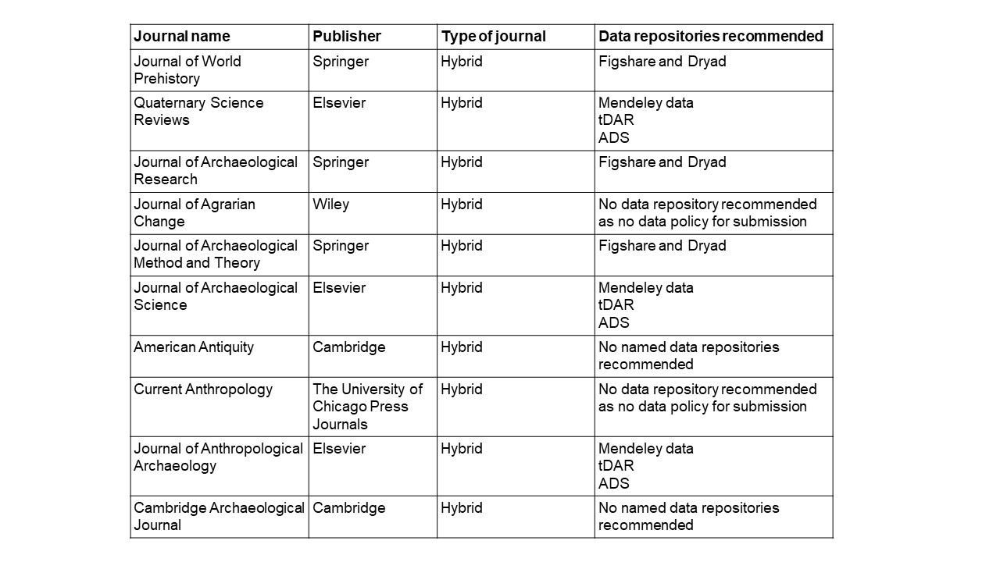

# Getting started with open repositories - Part 1 - What you might think 

This is the first part of a series of posts about open repositories in which I hope I can convince you that using free open repositories is a great solution for all your open data and really for any open research output.

In this first part, I will be dealing with what I think you might think now about open repositories. And then in part 2, I will go on to explain more about open repositories - the benefits and how to choose the right repository for you. Part 3 will explain how to use open repositories in more detail so you feel confident to get started using them. 

## Can I really deposit open archaeological data freely?  

**Yes you can!** 

You might still have concerns about sharing your data due to its sensitive nature, the desire to wait until full publication of results or a legal obligation to hold back data for the final site report. However, those researchers that can and do want to share data openly should not be excluded from doing this because of a lack of funds. 

I have a growing concern that many archaeological researchers believe the misconception that you always have to pay to make your data openly available in an open repository. This is not the case. There are many options to do this for free and free open repositories have certain advantages over those where you do have to pay a fee.

This concern started after several questions being raised at my recent talks, and a conversation with a colleague, about how I can afford to make my data open. My reply was ‘I have never paid to deposit my data and other research outputs and I don’t think I ever will’. 

I don’t think this stance comes from a position of privilege as, although I do live in the UK and I am now employed at a large institution to do my archaeological work, the repositories I use are free for anyone to use. The main advantage I have is that I have been lucky enough to receive training in using repositories (the training was also free!) and I’ve also had time to explore their use in my own work. 

This misconception about having to pay to deposit data, I think comes from two sources. 

**One is a mix up between open access publications and this being linked to depositing data openly with articles.** 

So let’s dig into this - depositing your data openly is not linked to your route of publication - it can be freely deposited in any open repository whether you pay for gold open access or not. 

To make your article free to access at the point of publication in a journal (called Gold open access) you do have to pay an article processing charge (APC), although there are also free alternatives to this! Your data has nothing to do with this payment - it is a separate entity from the article. 

Unfortunately, gold open access publishing is an exclusionary practice that benefits those that have funding to cover it or are based at institutions that have open access deals with certain publishers. But you don’t have to go the gold route to make your article accessible.

The majority of journals allow you to deposit a version of your article in a free open repository of your choice. This means you can use one of the hybrid journals through the non-open access publishing route, which does not charge you a fee for publishing. This is the green open access route. 

If you do want your paper to be open access in the journal and you can’t afford the APC, you have the option to ask for a fee waiver by writing to the editor or you could find a source of funding to cover this. There are also fee waivers and lower charges at some journals for researchers that come from low income countries.  

Gold or green open access publishing does not affect where you deposit your data.

So hopefully, I have made it clear that whether your article is open access or not, your data is a separate thing and so you don’t have to pay for a gold open access article to have open data.  

**The second source of this misconception is that pay-to-deposit open repositories seem to be well advertised in the archaeological community compared to the free alternatives**. 

Publishers are advertising these paid repositories in their author guidelines or not giving enough information generally to authors about open data deposition. Pay-to-deposit open repositories are also regularly referred to in articles about open data such as a recent special issue of Internet Archaeology on Digital archiving in Archaeology in which the Archaeological data service (ADS) and tDAR are mentioned countless times (link to this series of publications - https://intarch.ac.uk/journal/issue58/intro.cfm). 

This continuous promotion of pay-to-deposit open repositories is leading many researchers to the conclusion that depositing data openly is a cost they have to find. So conversely if they don’t have the funds, they are presuming sharing data openly is out of their reach. 

If we take a look at the data repositories suggested by the top 10 ranking archaeology journals, we find that very few of them name free open repositories. To find this ranking, I just did a google search and found the SCImago Journal Rank indicator. I’m not suggesting this is a good way to rank journals, in fact I don’t really pay attention to journal rankings at all! (https://www.scimagojr.com/journalrank.php?category=3302). 

*The table above shows the top 10 ranking archaeology journals and the data repositories that they recommend in their author guidelines or on their websites.*

The only free open repository named by these journals is Figshare and this is only in the Springer publications (3 out of the top 10).  Four of the journals do not name any repositories at all and two of these journals do not even have policies concerning data. 

As a side point - I do find it worrying that there is very little guidance for authors about open data in leading archaeological journals as this is a very current issue in which researchers need good advice. Journals should be taking the lead in publication best practice for data sharing such as the use of open repositories, FAIR data and data availability statements, but they are often falling short as was found here.

The other journals are from Elsevier publications. It is not a surprise that Elsevier advertise their own repository most strongly, and although this is free to use, I would suggest you think very carefully about depositing your data in a repository owned by a publisher. The commercialisation of the whole open science process is something I won’t cover here but please do read this article to find out more - [Publishers are increasingly in control of scholarly infrastructure and why we should care](http://knowledgegap.org/index.php/sub-projects/rent-seeking-and-financialization-of-the-academic-publishing-industry/preliminary-findings/).

Elsevier journals also suggests two pay-to-deposit open repositories for Archaeology, therefore, cutting down suggested repository options for authors (who might need suggestions to help them select a data repository) to their own free repository or two repositories that have to be paid for. 

Therefore, this lack of good advice concerning open data repositories is perpetuating this misconception. It is putting up an unnecessary barrier to the sharing of archaeological data.

Those working within large institutions that have access to institutional repositories or have funding for depositing data have a much easier decision to make in terms of data deposition as they are not restricted by cost - but others are! 

This barrier (even though it is a fictitious one) is excluding many researchers that work outside of large institutions or work within institutions that do not have or cannot fund access to a repository. The excluded researchers include: those working as freelancers for different organisations, contracted postdoctoral researchers that have no input in the funding application of their project or have no research funds for open access publications or open data included in their fellowships, and those working at institutions in low income countries that do not have funds to pay for institutional repositories or subject specific pay-to-deposit open repositories.

## Banishing this misconception

**To make it very clear - You do not have to pay to make your data openly available.**  

You can deposit it in whatever open repository you choose. It does not have to be in a repository suggested by the journal publisher, usually any repository can be used and this includes ones that are free. 

If you want to make your data openly available with the publication of an article, you just have to deposit your data before submitting your article and include a link to the data in your article (including the digital object identifier - DOI), preferably in a data availability statement near the end of the article.

I think we need to move to a more self-sufficient way of depositing research outputs so that we are taking responsibility for our own work and taking the responsibility away from publishers. Using the same open repository for all of your article pre-prints, data and other research outputs makes them readily discoverable and accessible by other researchers and will ultimately increase their impact. 

In my next post, I will explain in more detail what open repositories are, the different types, what the benefits are of using them and what repositories can be used for different purposes.

