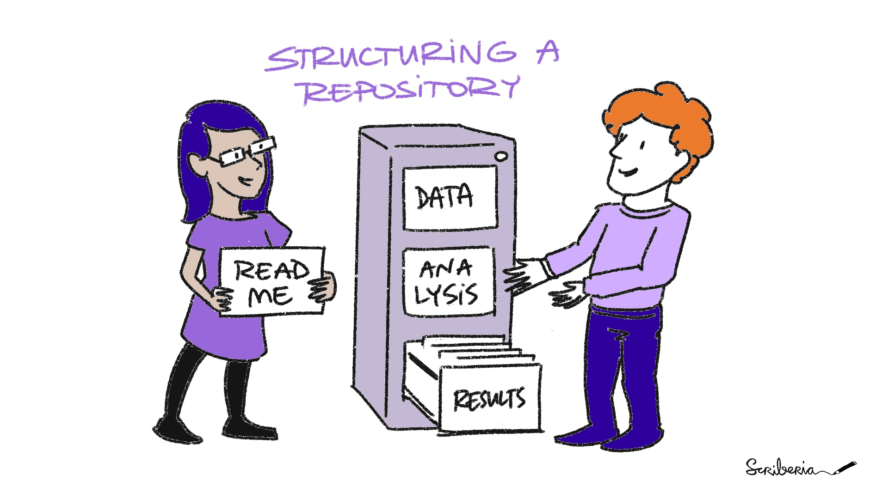

# Getting started with open repositories - Part 3 - How you might use open repositories

In part 1 I pointed out, hopefully politely, that open repositories could be free. 

Then in part 2, I went into more detail about what open repositories are and how you might choose one for your own research outputs.

Here in part 3, I am going to suggest a few ways that you might use open repositories in your research and also point you in the direction of further resources that will help you to actually get started using them.

## How you use an open repository depends on a number of different factors

**What type of research you are doing** 

The topic or material of your research can determine how, when, or even if you can, use an open repository. 
There are certain types of archaeological material and its associated data that are particularly sensitive in terms of showing the location of an archaeological site and also the remains having an ethical sensitivity such as data concerning human remains. There are also issues concerning who owns the data and materials from different past peoples and this will not be discussed here but is a very important issues to think about in any archaeological research project.

* We can start to think about these issues by using the [CARE principles](https://www.gida-global.org/care) that were developed for Indigenous data governance but have much wider relevance for all scientific data.
* Using the CARE principles in combination with the [FAIR principles](https://www.nature.com/articles/sdata201618) enables ethical and inclusive access to research. These are not just applicable to data but can be used for all research outputs. 

*This image was created by Scriberia for The Turing Way community and is used under a CC-BY licence. DOI: 10.5281/zenodo.3332807*

In cases where fully open outputs can’t happen, it might still be possible to make your research data and other research outputs openly available in a limited way. 
  * Sensitive data is used by other disciplines; especially those working in Medical research and patient data cannot usually ever be shared openly. 
  * There are different approaches to dealing with this and the most common is pseudo or total anonymisation of the data. This may be applicable to certain types of data in archaeology. 
  
Even if data cannot be made open, other outputs (such as articles and presentations) can be shared openly in open repositories to increase the accessibility of the research. 

**Who you are working for or who pays for your research** 

Are you working for an institution that has a policy about how to share research outputs or are you free to make your own decision about your research outputs?

There are often restrictions on sharing research outputs when conducting commercial work in archaeology.

In academic institutions, you often have more freedom to publish work openly, but you might have to stick to whatever policy they have. This might require your outputs to be deposited in an institutional repository.  

If you are not happy with the policy concerning open research practices at your institution, you could approach senior leaders to suggest changes. Here is a chapter of [*The Turing Way* about internal policy advocacy](https://the-turing-way.netlify.app/ethical-research/internal-policy.html) that might help you with this.

If your research is funded by UK Research & Innovation or European Research Council, they now require you to share your outputs openly. How you do this is very much your own choice at the moment and you often receive funds, or can budget for these costs in the grant, to enable you to do this, especially for open access publications.

**Who you are working with** 

You must consider the opinions and institutional restrictions of the researchers that you are working with.

Not everyone has the same opinion on working openly therefore you might need to make decisions on using open repositories on a project by project basis.
However, this might be a good opportunity to discuss with colleagues how to work in a more open and reproducible manner. 

*This image was created by Scriberia for The Turing Way community and is used under a CC-BY licence. DOI: 10.5281/zenodo.3332807*

## Ways to use open repositories

**There are a lots of ways to actually incorporate open repositories into your research workflows, here are a few suggestions:**

**Creating a central place for all your personal research outputs** 

You can use an open repository to put all of your articles, data, code, presentations, etc in one place.  

* If you choose one of the free open repositories it means that, whatever organisation you work for and however many times you move jobs, you can have some consistency with where your outputs are located. 
* Each output will be citable as it will be assigned a digital object identifier (DOI). This allows others to give you credit for all of your research outputs, not just academic articles. 
* You can also link your [ORCID](https://orcid.org/) to it and other links such as personal websites and social media accounts. 
* It will be of great benefit to you to make it easier for others to find and access your research. It means your work is more likely to be read, cited and reused. This gives your work greater impact. 

* [This blog is archived in Zenodo](https://zenodo.org/record/5062417#.YO2o7ej0mUk) so you can cite it if you refer to it. 

**Documenting an open source project** 

If you have no sensitivities or legal restrictions around the data and other research outputs in your project, and everyone in your team is committed to an open research approach, then being open from the beginning of the project is a great way to work. This is called an open source project.

* These projects show all their work, so this includes openly sharing work in progress and depositing different versions of work in open repositories.
* This is a fully transparent way of working that enables reproducible research.  
* There are lots of online tools to help you do this and Github is a good option as a project management tool that can be linked with an open repository. 
* Github gives you advanced version control so that you can track the history and contributions made to your project. 
* A less technical way to do this is to use Google drive and again linked to an open repository, in this case it has to be Open Science Framework. 

**Archiving research outputs at the end of a project** 

It is often the case that depositing your data, code and other research outputs is time restricted. This could be due to not being allowed to or not wanting to make them available until the work is fully completed. Therefore, the research outputs are typically deposited at the end of the project in one go. 

* This does not mean that you can’t work in the same way as you would in an open source project, as it’s still best practice to document the whole process and use version control throughout. In this circumstance you would keep this work private (set up a private repository) until it is ready to be released. 
* This applies particularly to projects with more sensitive themes and data, so that the right permissions and changes to the structure of the data are completed before making it available. 

## Resources to get more information about using and setting up repositories

Here are some good resources to get you started thinking about and using repositories:

[Information about data sharing from the UK data service](https://www.ukdataservice.ac.uk/manage-data/legal-ethical/consent-data-sharing.aspx).

Article about CARE and FAIR for Indigenous data futures - [Carroll et al. 2021](https://www.nature.com/articles/s41597-021-00892-0).

**From *The Turing Way*:**
* [Making research objects citable](https://the-turing-way.netlify.app/communication/citable.html).
* [Research data management](https://the-turing-way.netlify.app/reproducible-research/rdm.html).
* [Creating project repositories](https://the-turing-way.netlify.app/project-design/project-repo.html).

**Data repositories help pages:**

*Dataverse:* https://support.dataverse.harvard.edu/getting-started

*Figshare:* https://help.figshare.com/article/how-to-upload-and-publish-your-data

*Open Science Framework:* 
In Open science Framework you can group your research outputs by project and then each output can be a separate component. Here is a link to a help page for [setting up a project](https://help.osf.io/hc/en-us/articles/360019737594-Create-a-Project).

*Zenodo:* https://help.zenodo.org/ 

*You can cite this blog by using this citation:*

Emma Karoune, Esther Plomp, & Jennifer Bates. (2021, July 2). EKaroune/The-Open-Archaeobotanist: The Open Archaeobotanist blog October 2020 to July 2021 (Version v1.0). Zenodo. http://doi.org/10.5281/zenodo.5062417

