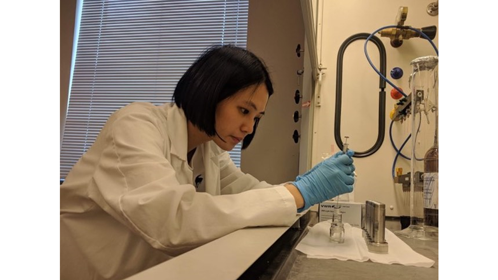

# The Open Archaeobotanist Guest Blog - Liying Wang

**[Liying Wang](https://osf.io/75evz/)** is a PhD Candidate at the University of Washington. 
She is working at the forefront of open archaeology by incorporating all aspects of open research into to her current PhD project that focuses on the colonization period in Taiwan. 

# Why I am an Open _Archaeologist_. 

## Why did you become an Open Archaeologist?

I believe open science is the best practice for conducting research, because it creates a more inclusive environment where everyone can access knowledge equally, regardless of their financial resources, which also advances science in the long run. 
[My PhD research](https://osf.io/75evz/) explores social changes in Indigenous societies during the European colonization period in Taiwan, which makes me further reflect on the relationship between privilege, knowledge, and power. 
I wonder what we can do to prevent “scientific colonization” when research materials and results collected by researchers from wealthy institutions are not shared back with communities or shared only with limitations and high costs. 

I find that open science is an excellent solution to ensure equal access for everyone to archaeological results and research processes. 
Also, I believe that when we make our data and methods freely available, it enables other researchers to examine our work in detail, which increases the credibility of our research. 
Therefore, I decided to make my work as open as possible through open data, open methods, and open access. 

Open data means that I deposit my raw data files on a trustworthy repository for anyone to freely access at any time. Open methods means I use a free and open source programming language to analyze and visualize my data, and I also freely share my R code files on a repository with my data files. 
Open access means I share my scholarly publications on a preprint server that anyone can freely access at any time. 

Although some types of data cannot be shared (such as site locations or sensitive cultural information), in these cases we can still strive for open methods and open access to increase research transparency and maximize the accessibility of our final outputs. 
By incorporating openness into archaeological work, I believe we can better align the ideals of archaeology as a public good with the actual practices of what archaeologists do. 

## How did you become an open archaeologist?

I started to take an open science approach when analyzing my research data during my PhD using open source software, such as the R programming language for data analysis and visualization. 
Once I got familiar with the software, I wrote my PhD papers and dissertation using R Markdown. 
This combines my data, code, figures, and text all together into a final output, such as a beautiful Word document or PDF document. 

I also use Git version control to ensure my work is fully reproducible, and all of my analytical decisions are traceable. 

Then I share my work on online repositories (Github, Open Science Framework and SocArXiv) to maximize the accessibility.  

Here are links to my work on these repositories:
* [My GitHub repositories](https://github.com/LiYingWang?tab=repositories). 
* [My OSF](https://osf.io/d3yz2/). 
* And [my preprints on SocArXiv](https://osf.io/preprints/socarxiv/3vfea/).

This workflow of open science practice can be easily applied to any piece of writing and analysis in archaeology. I presented a poster on this workflow at the 2020 CAA Australasia meeting, you can see the [poster here](https://osf.io/vp7qh/).

Since the reproducibility of research is key when making our research work open, I came to the realization that it is also important for students to have a chance to learn these skills. 
I incorporate this practice into assignments in classes that I teach, such as guiding students to replicate results of published papers or make their work reproducible step by step to promote open science in archaeology in the long run. 
This helps students to appreciate how important reproducibility is, and how hard it can be when authors don’t supply enough details to support their claims. 
I recently presented a [poster on this approach at the University of Washington Center for Teaching and Learning Symposium](https://osf.io/emhf8/). 
I also co-authored a paper that describes [how to do replication assignments in archaeology](https://doi.org/10.1017/aap.2019.38). 

In my department there is growing interest in open science, and a sense of urgency about the need for graduate students to learn how to work openly and reproducibly. 
To help address this need, I co-founded [“Anthro Data Science”](https://anthro-data-science.github.io/), which is a group of graduate students and early career researchers in anthropology (in the US archaeology is a sub-field of anthropology) who are passionate about sharing data science skills. 
We aim to create a friendly, supportive space for working together and guiding people using open source tools through our workshops. Any anthropologist is welcome to join!

My papers with open science practices can be found here: 

Wang, L. Y. and Marwick, B. (accepted in Aug 2021) A Bayesian networks approach to infer social changes in burials in northeastern Taiwan during the European colonization period. Journal of Archaeological Science, pre-print, data & code: https://osf.io/preprints/socarxiv/3vfea

Wang, L. Y. and Marwick, B. (2020) Ornaments as indicators of social changes resulting from indirect effects of colonialism in northeastern Taiwan. Archaeological Research in Asia 24. https://doi.org/10.1016/j.ara.2020.100226, pre-print, data & code: https://doi.org/10.31235/osf.io/z9p5k

Wang, L. Y. and Marwick, B. (2020) Standardization of ceramic shape: A case study from the Iron Age pottery from northeastern Taiwan. Journal of Archaeological Science: Reports 33. https://doi.org/10.1016/j.jasrep.2020.102554, pre-print, data & code: https://osf.io/preprints/socarxiv/q8hn9/

The paper I coauthored about teaching replication assignments can be found here: 

Marwick, B., Wang, L. Y., Robinson, R., & Loiselle, H. (2019) How to use replication assignments for teaching integrity in empirical archaeology. Advances in Archaeological Practice, 8(1), 78-86. https://doi.org/10.1017/aap.2019.38 pre-print, data & code: https://osf.io/preprints/socarxiv/tsxbv/

## What is your biggest frustration at the moment in terms of the adoption of open science practices in archaeology?

Compared to other fields in social science, the adoption of open science in archaeology has been relatively late and slow, which means we still have a long way to go to the point when open science becomes a common practice. 
This is especially obvious when we consider regional differences where the concept of openness is still very exotic and a source of anxiety and misunderstandings for some groups. 
This means we need to put lots of effort into educating people about open science practices to help people see their value and change current behaviors. 
In addition, the tension between archaeological data sharing and Indigenous sovereignty means archaeology may have a different pathway toward openness, that we should strive for a way to satisfy different interest groups. 
For this, the [CARE principles](https://www.gida-global.org/care) provide helpful guidance for ethical data sharing.

## What is the most inspirational piece of open research you have seen lately?

I was inspired a lot by Dr. Ben Marwick’s work, especially his paper [“Packaging Data Analytical Work Reproducibly Using R (and Friends)”](https://doi.org/10.1080/00031305.2017.1375986) that introduces the concept of a research compendium for organizing digital materials. 
I have been applying this approach to my work, and I especially thank Dr. Marwick for leading me to the world of open science, so that I can become an open archaeologist. 

Another piece I found very useful is by Jesse Alston and Jessica Rick (2020) that provides clear guidance for conducting reproducible research. 
They are ecologists, not archaeologists, but their paper is very suitable for beginners in any field to get started with: https://esajournals.onlinelibrary.wiley.com/doi/full/10.1002/bes2.1801.  

In addition, more and more recent archaeological papers make their data and code openly available. 
These can be found on the [list compiled on the GitHub page](https://github.com/benmarwick/ctv-archaeology). 
This list has more than 200 papers that are great examples of doing open research in archaeology. 
The Society of Archaeological Sciences has been promoting these papers on their social media channels, such as Twitter (https://twitter.com/socarchsci). 

## What one thing could an archaeological researcher do to easily make their work more open?

I think sharing our work on online trustworthy repositories (such as OSF, zenodo, dataverse, your university repository, etc.) and preprint services, could be easily achieved by most archaeological researchers. 
I especially recommend uploading our work before, or at the time of publication, to preprint services to enable maximum accessibility, then people can read your work even if they don’t have access to a university library. 
This offers benefits to both authors and readers by sharing and reading early and openly. 
We can also submit our manuscript to the preprint open peer review system, Peer Community In Archaeology (https://archaeo.peercommunityin.org/), which is an exciting new way to publish our manuscript openly. 

